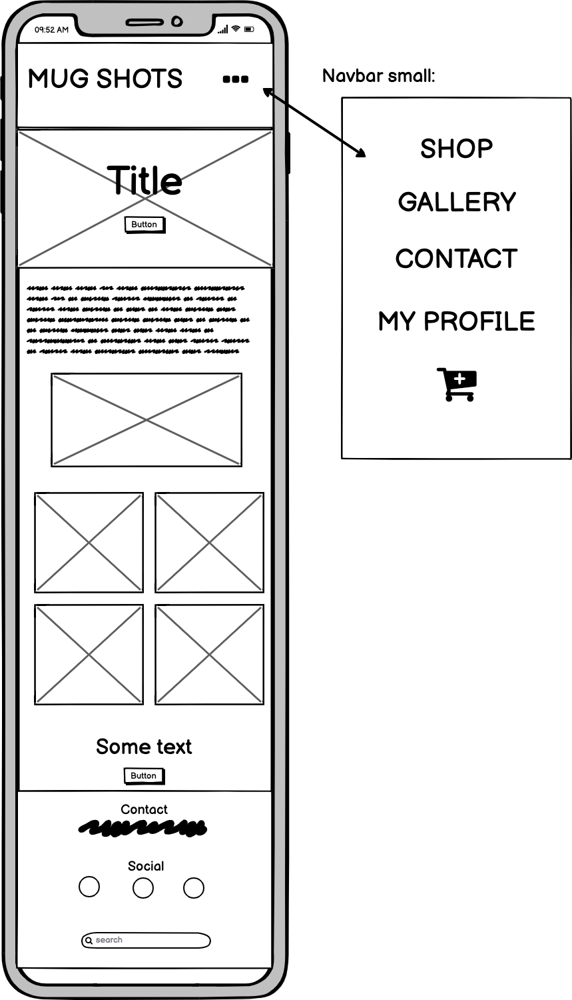
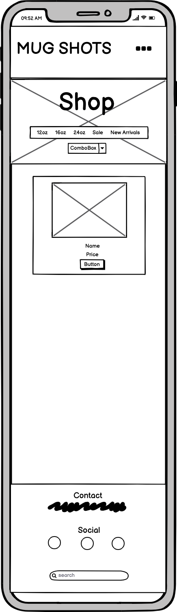
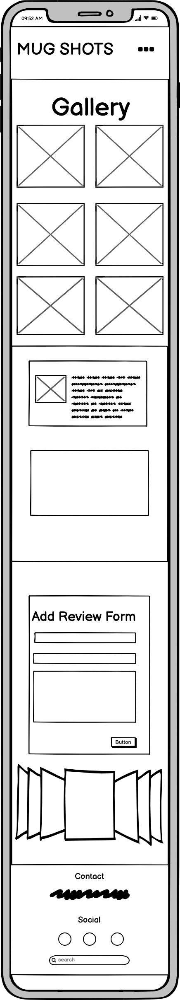
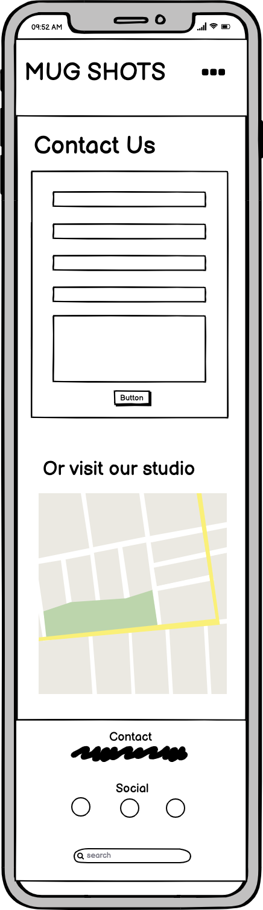
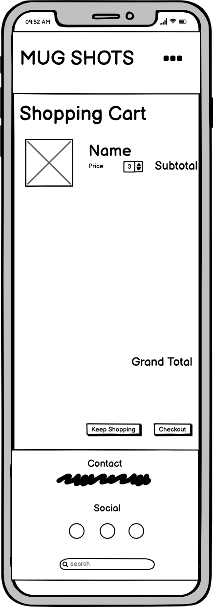
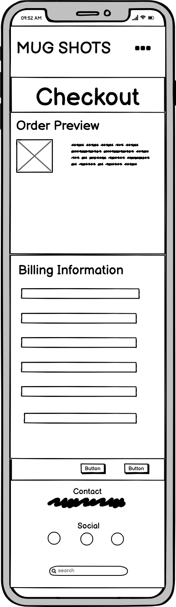
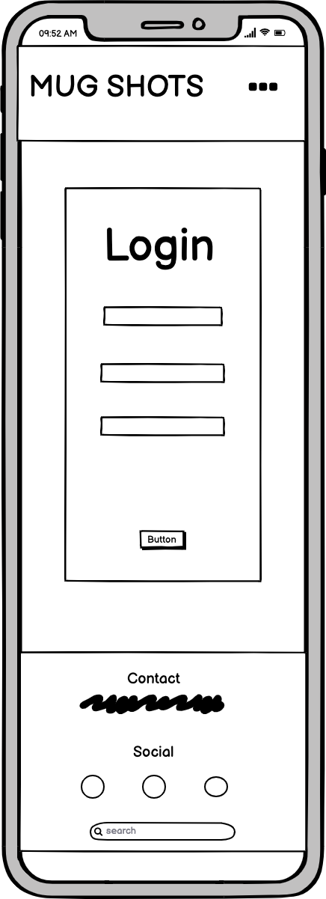
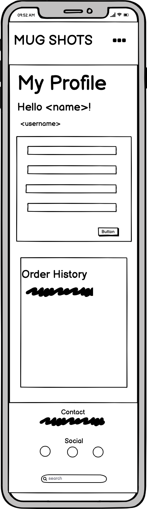

# Mug Shots

Drinking from a mug so good-its almost criminal. 

Live Demo: (https://mug-shots.herokuapp.com/)

The Mug Shots e-commerce website is developed for a fictional handmade pottery company who specializes in custom mugs. 
The main idea for this project was to combine all of the content learned from the Full Stack Developer course. 
This website is made with Django to build a fully functioning e-commerce website. 

If you would like to test the payment functionality of this project, please use the following payment details:
- Card number: 4242 4242 4242 4242 
- CVC: any 3 digit number
- Exparation Date: any future date
- Address: any address details

To test the site as a superuser, you can use the following credentials to login:
- Username: supertester
- Password: Test0499

The app is deployed on Heroku. 
Click here to view the deployed site

# Table of Contents
1. [UX](#UX)
    - [Main Requirements](#Main-Requirements)
    - [User Stories](#User-Stories)
    - [Design](#Design)
    - [Wireframes](#Wireframes)
    - [Database Structure](#Database-Structure)
2. [Features](#Features)
    - [Existing Features](#Existing-Features)
    - [Features Left To Implement](#Features-Left-To-Implement)
3. [Technologies](#Technologies)
4. [Testing](#Testing)
5. [Deployment](#Deployment)
    - [Local Deployment](#Local-Deployment)
    - [Heroku](#Heroku)
6. [Acknowledgement](#Acknowledgement)
7. [Credits](#Credits)

## UX

### Main Requirements
The Main requirement of this project was to create a full stack e-commerce website where both the user is able to 
successfully purchase a product and the owner is able to satisfy all CRUD functions to Create, Read, Update, and 
Delete products and reviews.

#### Additional requirements
* To view all products in a list
* View products individually with detailed product information
* Purchase the products using a secure checkout system
* Create an account, view/update personal information and view previous orders
* Contact the business for further information and technical support

#### Expectations
* Website is visually appealing and easy to navigate on all devices
* User can leave a review of the business and/or product
* User can edit their reviews
* Personal information will be stored securely, but will be able to be accessed when logged in

### User Stories
| User Story ID                  | As a/an     | I want to be able to…                                             | So that I can…                                                                |
|--------------------------------|-------------|-------------------------------------------------------------------|-------------------------------------------------------------------------------|
| Viewing and Navigation         |             |                                                                   |                                                                               |
| 1                              | Shopper     | View a list of products                                           | Choose one to purchase                                                        |
| 2                              | Shopper     | View product details                                              | Identify price, description, and image                                        |
| 3                              | Shopper     | View the cart at anytime                                          | To manage my purchase                                                         |
| 4                              | Shopper     | Adjust the quantity of items in my cart or completely remove them | To manage my purchase                                                         |
| Registration and User Accounts |             |                                                                   |                                                                               |
| 5                              | Site User   | Register for an account                                           | Have a personal account to view my profile                                    |
| 6                              | Site User   | Login and Logout                                                  | Easily access my personal information                                         |
| 7                              | Site User   | Recover my password                                               | Recover access to my account                                                  |
| 8                              | Site User   | Receive an email conformation                                     | Verify my registration was successful                                         |
| 9                              | Site User   | Have a personalized user profile                                  | To view my personal information such as payment information and order history |
| 10                             | Customer    | Leave a review                                                    | Leave my testimonial and support this small business                          |
| 11                             | Customer    | Edit my review                                                    | Edit my previously created review with new details                            |
| Sorting and searching          |             |                                                                   |                                                                               |
| 12                             | Shopper     | Sort the list of products                                         | View the available products by the size I prefer                              |
| 13                             | Shopper     | Search for a product by name or description                       | Quickly find the product I am interested in                                   |
| Purchasing and Checkout        |             |                                                                   |                                                                               |
| 14                             | Customer    | View items in my bag to be purchased                              | Identify the products and total cost before I purchase                        |
| 15                             | Customer    | Adjust the quantity or remove items in my bag                     | Easily make changes before checkout                                           |
| 16                             | Customer    | Enter my payment information                                      | Check out easily with no problems                                             |
| 17                             | Customer    | View an order confirmation after checkout                         | Verify there are no mistakes with my address, order, or payment information   |
| Admin and store management     |             |                                                                   |                                                                               |
| 18                             | Store Owner | Add a product                                                     | Add a new item to my store                                                    |
| 19                             | Store Owner | Edit a Product                                                    | Change any details in the price or description                                |
| 20                             | Store Owner | Delete a Product                                                  | Remove items that are no longer available                                     |
| 21                             | Store Owner | Edit and Delete reviews                                           | To be able to manage customer reviews                                         |

### Design

Doing some research on popular e-commerce websites, I was able to form an idea of how I wanted the atmosphere of the website to look. I knew that as a user of the website it would be important to have a simple design. Through my research, I found some websites that I thought were 
messy in their layout and hard to navigate. I knew I wanted my website to be image-led and very minimalistic with easy navigation.

With the basic idea in place, I knew the features of the website must be divided between three categories: 1) external users (anonymous users, who are not yet authenticated), 2) users who are logged in to their accounts, and 3) the store owner (also known as the superuser). All users are able to 
view the products in the store and the reviews in the gallery page. Only users who are logged in will be able to view their past order history, personal billing information, and edit or delete a review they previously created. The site owner would be able to view everything the users can view but 
will also be able to add, edit, and delete products from the store as well as manage the reviews. With this in mind, I decided on adding these feature ideas when creating my wireframes: 
* login/registration system 
* ability to leave reviews
* a gallery containing photos
* the ability to add desired products to a cart 
* confirm the purchase with a payment through Stripe
* ability to contact the store owner with any questions
In order to keep the user informed throughout their experience on the website, I also decided to add a notification system using Bootstrap's toasts feature, confirming the actions a user would take. For example, deleting a product from their cart or adjusting the quantity. 
The website also must meet content requirements to provide users with enough information about each product, including item pricing and details.

For this project, I chose a minimalistic dark mode style website. To soften the styling as to not have a harsh black or white, the colors #161616 (Muted black) and #dfdfdf (A light Gray, white color) were chosen for the main colors of the site.
These colors make up most of the website with two additional colors to help certain elements such as the buttons and titles pop. The colors, #d4af37 (Gold) and #133616 (Forest Green) were chosen to complement the main black and white design. 

For the font, I chose the classic font, "Ubuntu" for the main text on the site. This font is very clean to read and works well with the minimalistic theme. I wanted an additional font to make some of the titles and buttons stand out, so the font "Ranchers"
was chosen. The Ranchers font is bold, but still very clear and easy to read, giving the site a nice finishing touch.

The navigation bar was originally designed in the wireframes to display the logo of the site above the navigation bar. After working on the development of the site, it seemed to be more practical to have all of the navbar contents on the same line.
This helped to keep to a more minimalistic design. A feature was added where the navbar is transparent when the page is first loaded, but changes to the light gray color (#dfdfdf) on scroll. On large and medium screens, the user will be able to see which page
they are actively on by the white shadow you can see on the coffee cup icon.

Keeping to the minimalistic design, all of the forms have simple pages. The login/registration process contains only a form that will accomplish the specific action, such ad logging in, signing up, confirming email, and so on. The contact form on the contact
page follows this same design as well as the reviews form located on the contact page. To style the forms, I used the css property of box-shadow to create shadows & highlights underneath the forms giving it a slight glow. This css property uses horizontal & vertical offsetting
along with blur and spread and finally the color of the shadow itself to produce the desired effect.

A note about the 'cart' application. In the beginning, the site was developed using the term 'bag' as reflected in the code. However, it came to my attention that the users in the area where this website would be used, prefer to say 'cart' when shopping online. 
Thus, on the front end of the website, the term 'cart' is used instead of 'bag'.

###### Defensive Design

Throughout the build of this site various defensive features were added to protect against malicious activity, and also to stop things breaking.

A ``  `` was added on every form to prevent Cross Site Request Forgeries.

Included in a lot of the views and a lot of the templates are checks to ensure that the user has been authenticated. This helps avoid somebody who is already logged in to log in. It also helps ensure only registered users are accessing certain functions, such as making and editing reviews or viewing a personalized profile.

Several checks were put in place within the forms and the models to ensure all requests were receiving all the expected data. Adding 'required' to certain field helped ensure this was achieved and fields were not left blank.

The Google Chrome's Dev Tools were used to view the results of new features added on different screen sizes. Doing so helped me make any adjustments to styling including; the margins, padding and font sizes of different aspects of the project, as well as checking that new features were compatible on all screens. The functionality of each feature was tested as it was added to the project to notice issues as they arose.

### Wireframes
> Home Page

> Shop Page 

> One Product Page 

> Gallery Page

> Contact Page

> Cart Page

> Checkout Page

> Login/Register Page

> Profile Page

### Database Structure
During development with Django, I used the SQLite3 database. After the project was deployed to Heroku, 
I changed to using a PostgresSQL database that is provided by Heroku as an add-on for production. 
I also relied on Django’s default user model for authorization, allowing me to meet one of the project requirements of separating features by anonymous users, users in session, and superusers. 
The structure of the Checkout and Services apps were inspired by my studies with Code Institute, namely the Boutique Ado project. 

The Database Structure was first drawn to see how the database data would relate to each other across the site.

After the rough sketch was drawn, I was able to use Numbers (Apple's built in spreadsheet software) to help plan the structure of the models.

When each app and its models were created and implemented, `` python manage.py makemigrations `` was run in the terminal to create the initial model package and `` python manage.py migrate `` was then used to apply the model to the database and create the table.

This project heavily relies on Django’s default user model for authorization. One of the project requirements were in separating features by anonymous users, users in session and superusers.

Profiles app:
The models in the profiles app have the goal of saving and retreiving the default shipping information for the user in session.

| Name             | Database Key            | Field Type   | Validation                                       |
|------------------|-------------------------|--------------|--------------------------------------------------|
| Phone Number     | default_phone_number    | CharField    | max_length=20, null= True, blank =True           |
| Street Address 1 | default_street_address1 | CharField    | max_length=80, null= True, blank =True           |
| Street Address 2 | default_street_address2 | CharField    | max_length=80, null= True, blank =True           |
| Town or City     | default_town_or_city    | CharField    | max_length=40, null= True, blank =True           |
| County           | default_county          | CharField    | max_length=80, null= True, blank =True           |
| Postcode         | default_postcode        | CharField    | max_length=20, null= True, blank =True           |
| Country          | default_country         | CountryField | blank_label ='Country', null = True,  blank=True |

Contact app:
The contact models exist to create a contact form and send that form to the site owner by email.

| Name       | Database Key    | Field Type    | Validation/Requirements                   |
|------------|-----------------|---------------|-------------------------------------------|
| First Name | first_name      | CharField     | max_length=200                            |
| Last Name  | last_name       | CharField     | max_length=200                            |
| Subject    | contact_subject | CharField     | max_length=200                            |
| Email      | email           | CharField     | max_length=200                            |
| Message    | contact_body    | TextField     | max_length=5000                           |
| Date       | contact_date    | DateTimeField | default=datetime.now, blank=True          |
| User       | query_user      | ForeignKey    | User, null=True, on_delete=models.CASCADE |

Products app:
The models in the products app were created to display all of the products in the store
| Name             | Database Key            | Field Type   | Validation                                       |
|------------------|-------------------------|--------------|--------------------------------------------------|
| Phone Number     | default_phone_number    | CharField    | max_length=20, null= True, blank =True           |
| Street Address 1 | default_street_address1 | CharField    | max_length=80, null= True, blank =True           |
| Street Address 2 | default_street_address2 | CharField    | max_length=80, null= True, blank =True           |
| Town or City     | default_town_or_city    | CharField    | max_length=40, null= True, blank =True           |
| County           | default_county          | CharField    | max_length=80, null= True, blank =True           |
| Postcode         | default_postcode        | CharField    | max_length=20, null= True, blank =True           |
| Country          | default_country         | CountryField | blank_label ='Country', null = True,  blank=True |

Categories:
The product model heavily relies on the categories 

| Name          | Database Key  | Field Type | Validation/Requirements               |
|---------------|---------------|------------|---------------------------------------|
| Name          | name          | CharField  | max_length=200                        |
| Friendly Name | friendly_name | CharField  | max_length=200, null=True, blank=True |

Reviews: 
The reviews model was created to display user reviews on the gallery page:

| Name           | Database Key   | Field Type | Validation/Requirements                                                                      |
|----------------|----------------|------------|----------------------------------------------------------------------------------------------|
| User           | user_profile   | ForeignKey | UserProfile, on_delete =models.SET_NULL, null= True, blank=True, related_name="user_profile" |
| Product        | product        | ForeignKey | Product, on_delete=models.SET_NULL, null=True, blank=True, related_name= "user_product",     |
| Review Title   | review_title   | CharField  | max_length=200                                                                               |
| Review Content | review_content | TextField  | blank=True, null=True, default=""                                                            |

Whenever possible, first-time-right methodology was used when creating each of the models to avoid too many alterations to the models and the database table through multiple makemigrations and migrate commands. 
Throughout development, a few of the fields were adjusted and those commands needed to be run again.

## Features
### Existing Features

This project is fully responsive and renders as expected on all up to date browsers. It also contains several pages many key features.

##### Navbar
All pages contain a navigation bar to allow for easy access. 
The menu at the top of the page is consistent in design and are responsive throughout the website. 
It contains links to the main pages for the site to allow for easy access. 
However, the contents of the menu changes depending on if a user is logged in or not.
The navigation bar for logged in users features a 'Logout' link where the 'Register' and 'Login' links usually are. 
When a user in session chooses to sign out, a message confirms this action and they are redirected back to the home page.
The active page is highlighted in a light gray color to show the user which page they are on.

##### Footer
The Footer at the bottom of the page is consistent in design and is able to be viewed across the site.
This section of the page contains contact information, links to the store social media, and a search bar to allow the user to search for products in the store.
If no products are found or the search bar is submitted blank, a message will appear inviting the user to try again.

##### Home page
The home page is the main landing page for this site. It features a large image with a call to action button to begin shopping.
The user is also able to see a short paragraph and photo in the about us section about the company.
There is also a small responsive grid of photos that will allow the user to visit the company instagram to view more photos. There is 
another call to action button at the bottom of the page to invite the user to purchase a product.

##### Shop page
The shop page contains all products in database in a card, designed to look like a Polaroid. Each card contains the product image, name, price, category, and a button to view more details.
Bootstrap's grid helps the cards to display in a responsive way.
At the top of the page, the user is able to view the available products by category and sort all products by price or size.

##### One Product Page
The One Product Page displays aditional information about the selected product from the shop page. The user will be able to view the name, price, category, description, and sku.
There is a quantity box to allow the user to add any number of the selected product to the cart.
A product can be added to the cart by clicking the button at the bottom of the page "Add to Cart". If the item is successfully added to the cart, the grand total price in the navbar will increase
and a toast message sucess will show the current contents of the cart. 
If the user is admin, there are also 2 buttons displayed in the cards: Edit and Delete. Clicking Edit button redirects admin to the Edit Product page. 
Clicking the Delete button deletes the product. The page reloads and the toast message will inform about the successful deletion. 
These actions can be done only by superuser, attempts to access them by other users will end up redirected to the homepage with toast error messages displayed.

##### Gallery page
The gallery page was created to showcase the potential products that can be viewed in the store. The responsive grid located at the top of the page contains many images. When hovering over the images, 
the name of the product and number of hearts can be seen. Clicking on any of these images will take the user to the store's instagram page.
Below the image grid are the review cards. Any user can view the previously created reviews. They are stored in the database with the fields: title, author, message, and product name. 
If a user is logged in, they will be able to add their own testimonial by filling out the form. Once they have created a review, they will be able to edit or delete their own review.
If they aren't logged in, a message will appear inviting them to login or register to write a review. 
A superuser is able to edit or delete any of the reviews on the page. 

##### Contact Page 
The contact page allows any user to fill out a form and send a message to the store owner. If the form is valid on submit, the user will view a success message. 
If the user is logged in, the form will be populated with their name and email.
This page also contains a simple google maps api map to allow the user to see where the store is actually located so they can visit.

##### Profile page
The main goal of the profile page is to allow the user to insert their billing/shipping information. If the user is logged in during checkout or when trying to fill out the contact form, 
their personal information will already be populated. On the profile page, the user will be able to view their past orders and click on them to once again view the order summary. The profile link in the navbar is only available to users who are logged in.

##### Login/Register
Created with Django- Allauth, the login and register has all of the standard features to create a new user. Styling was customized to make it unique.
There are pages included to handle:
* Sign up - requires username, email, password twice and an email will be sent with a verification link

* Login - requires either username or email and password with a toast message confirming successfully signed in

* Logout - Once completed logout, a toast message confirming successfully logged out

* Forgot password - requires email and email will be sent to link to update password

##### Cart
If no items are in the cart and the user navigates to the cart page, they will view a message that reads "There are no items in your cart". They will also be presented with a button that asks
if they would like to continue shopping that redirects to the shop page. If the user does have items in their cart, the items will be displayed in a table, with the options to update the quantity of the product or delete the product.
If the user amends a products quantity to zero, the item will be removed from the cart.
Once an item is added to the cart the total quantity is displayed on the Cart icon in the Navbar. 
A free delivery threshold exists, if the total price is below the free delivery threshold, a small message will appear letting the user know how much money is required for free shipping.
At the bottom of the page, if the user selects the checkout button, they will be taken to the checkout page. If they select the other button, they will be directed to the shop page to continue adding more products.

##### Checkout
If a user has added any items to their cart and clicks the Checkout button at the bottom of the page, they will be taken to the checkout page.
Here the user adds their details to an input form and can select whether to save the information to their profile for future purchases. 
The user will also be able to see an order summary of the items they plan to purchase as well as a grand total and cost of shipping (if applicable).
The user is also able to click a button to return to the cart if they would like to make any changes to the cart.
Once the order is submitted, an overlay with a spinning arrow is shown to let the user know their order is being processed.
After the order has successfully been completed, a checkout success page is shown. This page will only be shown when the user completes checkout or revisits the 
order history page and clicks on an order number in their profile. It was decided to allow a guest user to checkout and make a purchase to the sitr, instead of requiring a login to complete the steps. This was in the interests of the site owner
who's main goal is to get as many orders as possible, leading to a higher income. If the user were required to make an account before purchasing, they may feel that it is too much trouble to create an account and verify their email.

##### Admin
Only available to the superuser/admin, this page allows the user to add new products to the database, including an image. If the form is valid, it will bw submitted to the database 
and can be viewed on the shop page. The admin is also able to navigate to any product in the store's one product page and be able to edit or delete the product.
The defensive design is implemented to restrict other than admin users to manually enter the url to get access to the page. If tried, the user will be redirected to the home page with a toast error message.

### Features Left To Implement

* 404 Errors required for instances where usher visits an unavailable page
* After successfully ordering a product, email confirmation is sent for order
* A page for the staff to see all orders made my customers, for fulfillment purposes to track orders completed and orders to do
* Star rating for reveiws and reviews for individual products
* To be able to signup/login through social media acounts facebook and google
* A reset password feature for logged in users, in case the user forgets their password
* Add a custom item where the user can add a specific size and color of their choosing to the cart
* A wishlist for users to save items they would like to purchase later

## Technologies

Languages, Frameworks, Libraries and other tools used for this project:

* [Gitpod](https://www.gitpod.io/): Used as IDE to write, run, and debug the code used for the web-app.
* [Github](https://github.com/): Used for version control of the code by using Git functions in the control panel.
* [Heroku](https://heroku.com/): Used as deployment platform
* [SQlite3](https://www.sqlite.org/index.html): SQL database engine
* [PostgreSQL](https://www.postgresql.org/): Object-relational database system
* [Django]( https://www.djangoproject.com/): Web framework
* [AWS S3 Bucket](https://aws.amazon.com/s3/): Used to store static and media files in production

### Front-End Technologies
* [HTML](https://developer.mozilla.org/en-US/docs/Web/HTML): Used as a fundamental basis for building the web-app. Where possible semantic HTML is used to give the user a better understanding.
* [CSS](https://developer.mozilla.org/en-US/docs/Web/CSS): Used for styling of elements within the website. 
* [JavaScript](https://www.javascript.com/): Provides dynamic interactivity, as it is a full-fledged versatile programming language.
* [Bootstrap](https://getbootstrap.com/): To customise the html and make it responsive to different devices.
* [JQuery](https://www.jquery.com/jquery-3.4.1): Simplifies many complicated tasks from JavaScript, such as AJAX calls and DOM manipulation. 
* [Google Maps API](https://cloud.google.com/maps-platform/?utm_source=google&utm_medium=cpc&utm_campaign=FY18-Q2-global-demandgen-paidsearchonnetworkhouseads-cs-maps_contactsal_saf&utm_content=text-ad-none-none-DEV_c-CRE_460848633793-ADGP_Hybrid%20%7C%20AW%20SEM%20%7C%20BKWS%20~%20Google%20Maps-KWID_43700036076725534-kwd-21146297871-userloc_9010810&utm_term=KW_%2Bgoogle%20%2Bmaps-ST_%2Bgoogle%20%2Bmaps&&gclid=CjwKCAjw8-78BRA0EiwAFUw8LDMm7p1T37ZiJgPBGJ66njkqOEKJFNebaxLSNgA1ysEMk7JjORh-gBoCxgkQAvD_BwE): to show a simple map 

### Back-End Technologies
* [Python]( https://www.python.org/): Python3 is used as programming language
* [Allauth](https://fontawesome.com/?from=io): Addressing authentication, registration and account management
* [Stripe](https://stripe.com/docs/payments/checkout): To enable the user to make payments and check credit cards
* [Crispy-forms](https://fontawesome.com/?from=io): To easily build the forms and make them user-friendly.
* [Pillow 4.3.0](https://pillow.readthedocs.io/en/stable/handbook/overview.html): Adds image processing capabilities to your Python interpreter. This library provides extensive file format support, an efficient internal representation, and fairly powerful image processing capabilities.
* [Jinja](https://jinja.palletsprojects.com/en/2.11.x/): A modern and designer-friendly templating language for Python. It is fast, widely used and secure with the optional sandboxed template execution environment.
* [Boto3](https://boto3.amazonaws.com/v1/documentation/api/latest/index.html): The Amazon Web Services (AWS) SDK for Python. It enables Python developers to create, configure, and manage AWS services, such as S3.
* [Gunicorn](https://docs.gunicorn.org/en/stable/): A Python WSGI HTTP Server to enable deployment to Heroku
* [Psycopg2]( https://pypi.org/project/psycopg2/): needed to enable the PostgreSQL database to function with Django

Template- Code Institute
The template provided by Code Institute is used as basis (https://github.com/Code-Institute-Org/gitpod-full-template.git). A repository was created on GitHub by choosing the green "Use this template" button.

## Testing
Please visit the testing file [here](TEST.md) to read more.

## Deployment
This project was developed using the Gitpod environment. It used Gitpod for version control. The project was regularly committed to GitHub after each crucial piece of coding.
The deployed project can be viewed on the following link: 
The project's GitHub repository can be viewed with the following link: 

### Local Deployment
If you would like to further contribute to this project, you can clone it to your local machine using the following steps:

1. Select the Repository from the Github Dashboard.

2. Click on the "Clone or download" green button located above and to the right of the File Structure table.

3. Click on the "clipboard icon" to the right of the Git URL to copy the web URL of the Clone.

4. Open your preferred Integrated Development Environment (IDE) and navigate to the terminal window.

5. Change the current working directory to the location where you want the cloned directory.

6. Enter the following command and press 'Enter' to create your local clone:
        
        git clone https://github.com/amybru/mug_shots

7. Install the required dependencies. Add the following command to the terminal:
        
        pip3 install -r requirements.txt

8. Add the environment variables. If using Gitpod, the environment can be set in the settings. Or you can create an .env file. Add your env.py file to .gitignore to make sure your database information is not viewable to others and to keep your values safe. Add the following values:
        
        SECRET_KEY
        STRIPE_PUBLIC_KEY
        STRIPE_SECRET_KEY
        STRIPE_WH_SECRET
        DATABASE_URL

9. To set up the Django SQLite3 tables required for this project, use the following commands:
        
        python3 manage.py makemigrations
        python3 manage.py migrate

10. Create a Superuser for your project to work as an admin. Add the following command to the terminal, then create username and password for the superuser.
        
        python3 manage.py createsuperuser

11. You can now run the cloned application to test it using the following command:
        
        python3 manage.py runserver

### Heroku
To deploy the project to Heroku, follow the steps above in "Local Deployment", then complere the following steps:

1. Register/sign in for Heroku.

2. Once signed in, click the "new" button on the dashboard to create a new application.

3. Name the App and choose the region you are currently in.

4. To use the Postgres database for deployment, select 'Heroku Postgres' as a free add-on.

5. After the app is created, go to the 'Settings' tab and click on the 'Reveal Config Variables' button. Input the following values:

| Key               | Value                                   |
|-------------------|-----------------------------------------|
| DATABASE_URL      | Heroku Postgres database url            |
| SECRET_KEY        | secret key used for your Django project |
| STRIPE_PUBLIC_KEY | obtained through your Stripe account    |
| STRIPE_SECRET_KEY | obtained through your Stripe account    |
| STRIPE_WH_SECRET  | obtained through your Stripe account    |
| ADMINS_EMAIL      | email admin for the emails feature      |
| GOOGLE_MAP_KEY    | obtained from google maps api           |  

6. Create a requirements.txt file in your gitpod terminal/
        
        pip3 freeze --local > requirements.txt

7. Create a Procfile with the following content
        
        echo web: gunicorn mug_shots.wsgi:application > Procfile

8. Set up the database with Postgres.
        
        python3 manage.py makemigrations
        python3 manage.py migrate

9. Create a Superuser for your project to work as an admin. Add the following command to the terminal, then create username and password for the superuser.
        
        python3 manage.py createsuperuser

10. You can now run the cloned application to test it using the following command:
        
        python3 manage.py runserver

11. Commit these changes to your repository:
        
        git add .
        git commit -m "<your commit message here>"

12. With these changes made and commited in gitpod, log into heroku and enter your login credentials.
        
        heroku login -i

13. Once you have successfully logged into Heroku from the terminal, link your Heroku app to your remote repository
        
        heroku git:remote -a <your app name here>

14. Finally, push the project to Heroku

        git push heroku master

##### Hosting media files with AWS
The static files and media files for this project are currently hosted in an AWS S3 Bucket. To host them, you need to create an AWS account and create your S3 bucket, making sure to allow public access.
After creating an account and uploading the files, the following environment variables should be added via the settings or .env file.
        
        USE_AWS (set to True)
        AWS_ACCESS_KEY_ID
        AWS_SECRET_ACCESS_KEY

##### Sending Emails with Gmail
In order to send real emails from the website, you must connect it to a Gmail account. 
Either use an existing Gmail account or create a new one, then sign in and navigate to the Google Account Security page. From here, create two-step authentication by creating an App password for a Django app. 
Add the following environment variables to your settings or .env file.
       
        EMAIL_HOST_USER
        EMAIL_HOST_PASS

## Acknowledgement
I would like to thank and credit the following sources for their assistance and contribution to this project.

* My mentor with Code Institute, Gerard McBride, for helping me to brainstorm and coaching me through this project

* The tutoring Team at Code Institute for helping me fix several bugs and understand why these errors were happening

* A big thanks to my friends and peers for helping me test the site extensively, to make sure each feature worked as expected on various devices.

## Credits

##### Images
All Images are taken from [Unsplash](https://unsplash.com/) .

##### Icons
Icons are from [Font Awesome](https://fontawesome.com/?from=io) .

##### Fonts
The fonts, Ubuntu and Ranchers, are from [Google Fonts](https://fonts.google.com/) .

##### Wireframes
The wireframes attached to this README were created using [Balsamiq](https://balsamiq.com/).

Prices, names, and descriptions on all products are fictional.

##### Code
Several apps included the code are inspired by the Boutique Ado mini project from Code Institute. Their tutorial videos assisted me in creating
many of the apps required for this project, including: the checkout app and the add to cart functionality.

> NOTE: This project was created for educational purposes only as 'Mug Shots' is a fictional business.