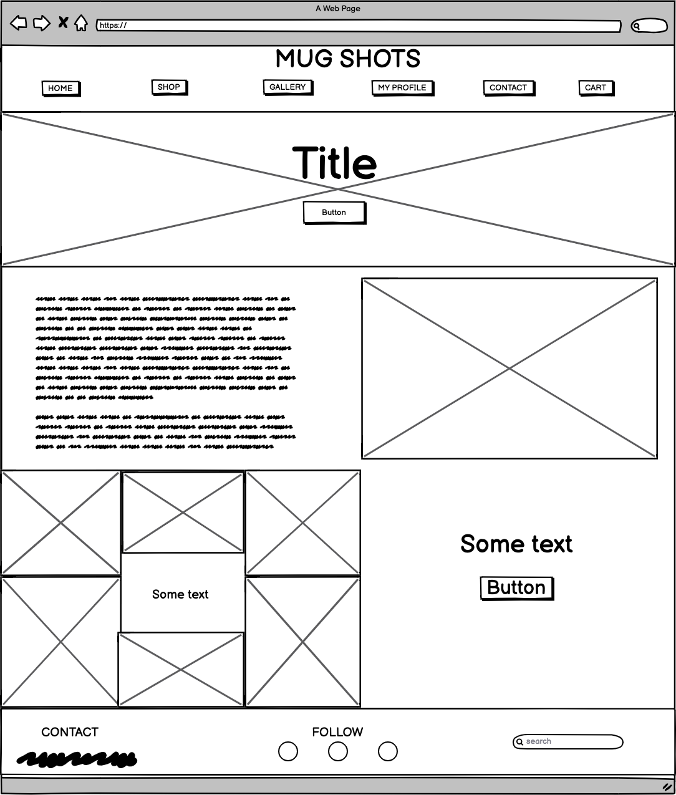
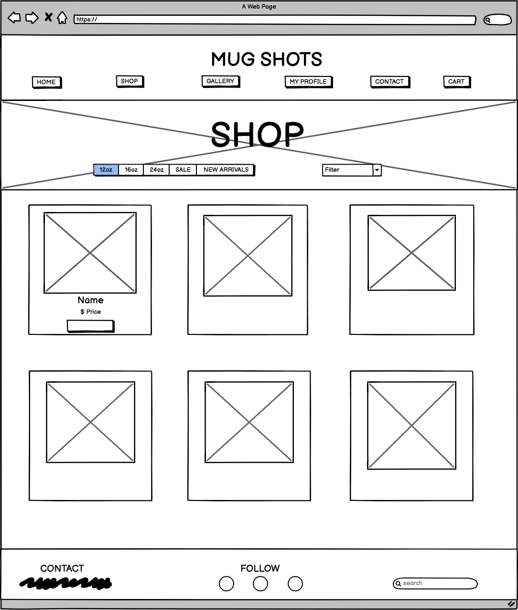
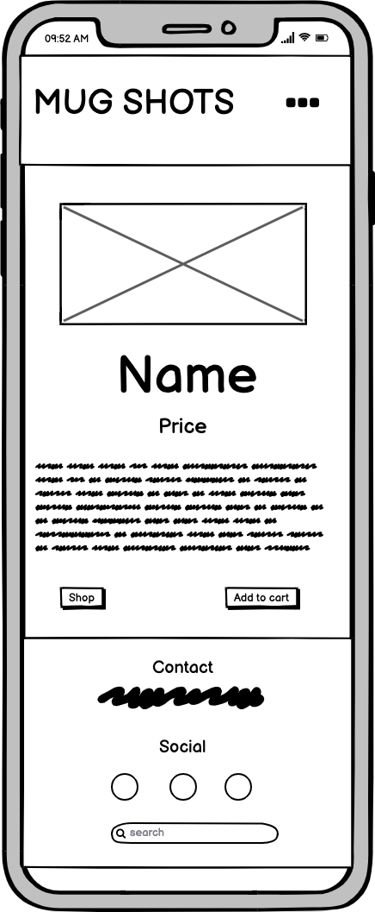
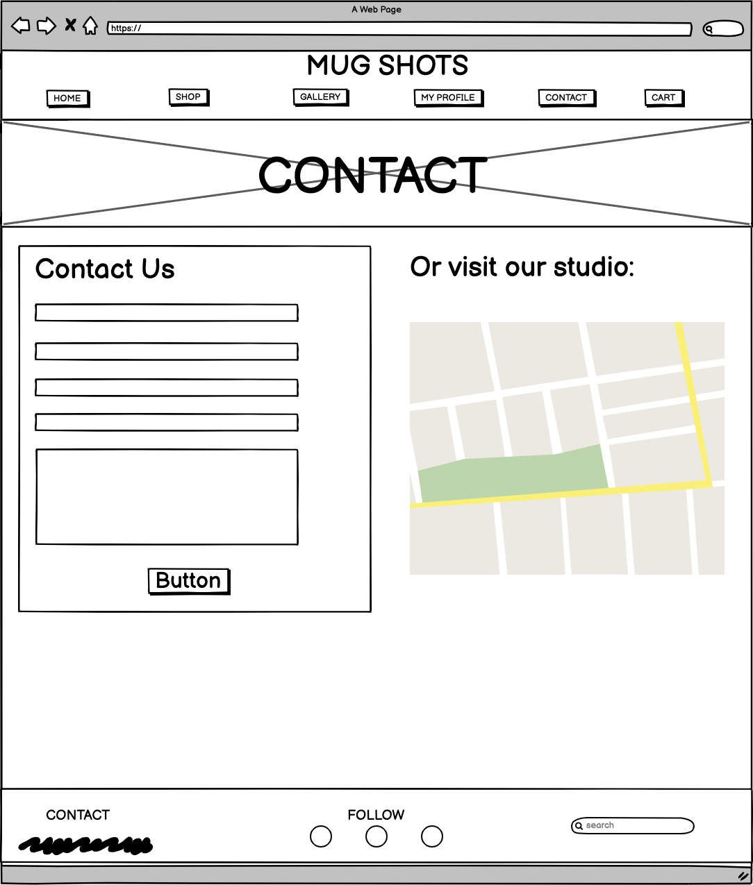
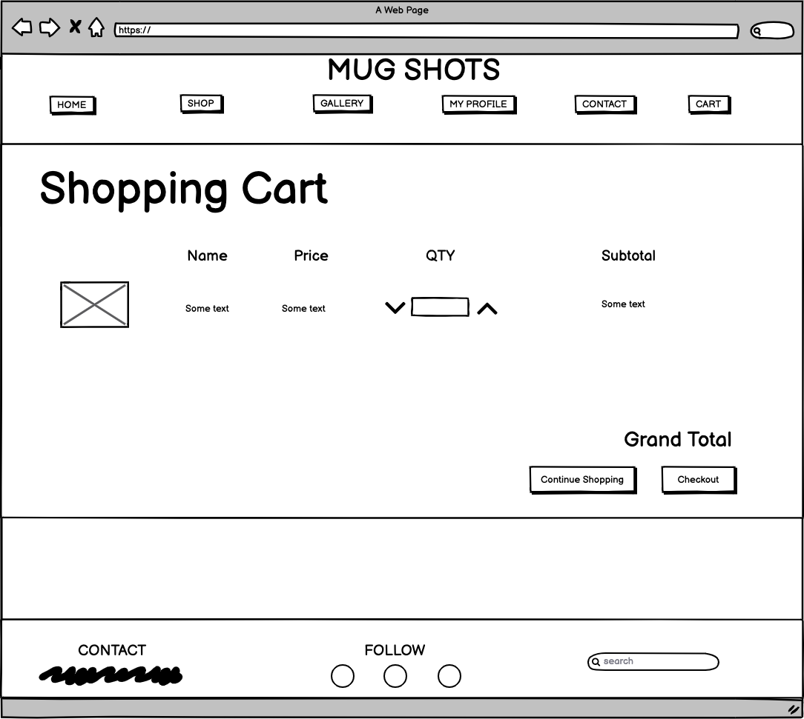
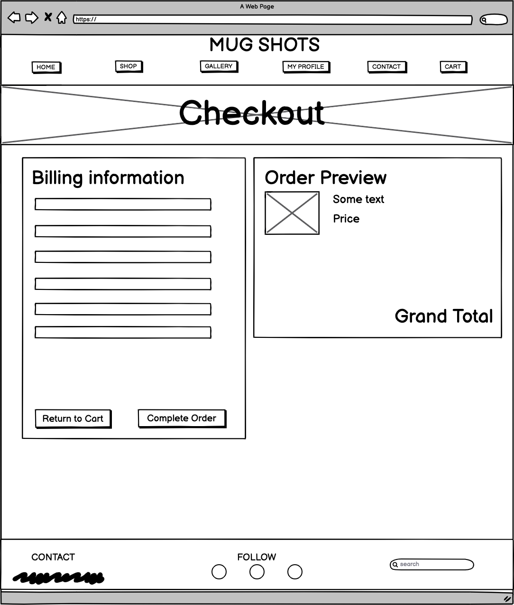
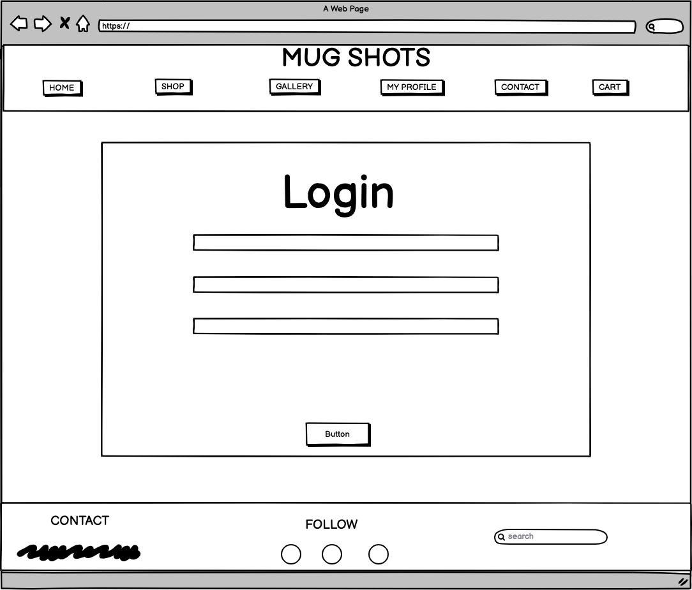
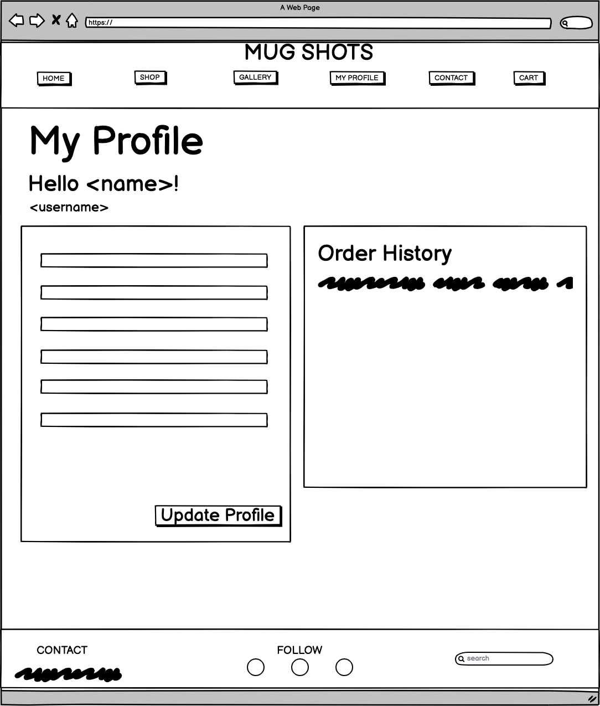

# Mug Shots

## A Code Institute Milestone 4 Project
Live Demo: (https://mug-shots.herokuapp.com/)

The Mug Shots e-commerce website is developed for a fictional handmade pottery company who specializes in custom mugs. 
The main idea for this project was to combine all of the content learned from the Full Stack Developer course. 
This website is made with Django to build a fully functioning e-commerce website. 

If you would like to test the payment functionality of this project, please use the following payment details:
- Card number: 4242 4242 4242 4242 
- CVC: any 3 digit number
- Exparation Date: any future date
- Address: any address details

The app is deployed on Heroku. 
Click here to view the deployed site

# Table of Contents
1. [UX](#UX)
    - [Main Requirements](#Main_Requirements)
    - [User Stories](#User_Stories)
    - [Design](#Design)
    - [Wireframes](#Wireframes)
    - [Database Structure](#Database_Structure)
2. [Features](#Features)
    - [Existing Features](#Existing_Features)
    - [Features Left To Implement](#Features_Left_To_Implement)
3. [Technologies](#Technologies)
4. [Testing](#Testing)
5. [Deployment](#Deployment)
    - [Local Deployment](#Local_Deployment)
    - [Heroku](#Heroku)
6. [Acknowledgement](#Acknowledgement)
7. [Credits](#Credits)

## UX

### Main Requirements
The Main requirement of this project was to create a full stack e-commerce website where both the user is able to 
successfully purchase a product and the owner is able to satisfy all CRUD functions to Create, Read, Update, and 
Delete products and reviews.

#### Additional requirements
* To view all products in a list
* View products individually with detailed product information
* Purchase the products using a secure checkout system
* Create an account, view/update personal information and view previous orders
* Contact the business for further information and technical support

#### Expectations
* Website is visually appealing and easy to navigate on all devices
* User can leave a review of the business and/or product
* User can edit their reviews
* Personal information will be stored securely, but will be able to be accessed when logged in

### User Stories
| User Story ID                  | As a/an     | I want to be able to…                                             | So that I can…                                                                |
|--------------------------------|-------------|-------------------------------------------------------------------|-------------------------------------------------------------------------------|
| Viewing and Navigation         |             |                                                                   |                                                                               |
| 1                              | Shopper     | View a list of products                                           | Choose one to purchase                                                        |
| 2                              | Shopper     | View product details                                              | Identify price, description, and image                                        |
| 3                              | Shopper     | View the cart at anytime                                          | To manage my purchase                                                         |
| 4                              | Shopper     | Adjust the quantity of items in my cart or completely remove them | To manage my purchase                                                         |
| Registration and User Accounts |             |                                                                   |                                                                               |
| 5                              | Site User   | Register for an account                                           | Have a personal account to view my profile                                    |
| 6                              | Site User   | Login and Logout                                                  | Easily access my personal information                                         |
| 7                              | Site User   | Recover my password                                               | Recover access to my account                                                  |
| 8                              | Site User   | Receive an email conformation                                     | Verify my registration was successful                                         |
| 9                              | Site User   | Have a personalized user profile                                  | To view my personal information such as payment information and order history |
| 10                             | Customer    | Leave a review                                                    | Leave my testimonial and support this small business                          |
| 11                             | Customer    | Edit my review                                                    | Edit my previously created review with new details                            |
| Sorting and searching          |             |                                                                   |                                                                               |
| 12                             | Shopper     | Sort the list of products                                         | View the available products by the size I prefer                              |
| 13                             | Shopper     | Search for a product by name or description                       | Quickly find the product I am interested in                                   |
| Purchasing and Checkout        |             |                                                                   |                                                                               |
| 14                             | Customer    | View items in my bag to be purchased                              | Identify the products and total cost before I purchase                        |
| 15                             | Customer    | Adjust the quantity or remove items in my bag                     | Easily make changes before checkout                                           |
| 16                             | Customer    | Enter my payment information                                      | Check out easily with no problems                                             |
| 17                             | Customer    | View an order confirmation after checkout                         | Verify there are no mistakes with my address, order, or payment information   |
| Admin and store management     |             |                                                                   |                                                                               |
| 18                             | Store Owner | Add a product                                                     | Add a new item to my store                                                    |
| 19                             | Store Owner | Edit a Product                                                    | Change any details in the price or description                                |
| 20                             | Store Owner | Delete a Product                                                  | Remove items that are no longer available                                     |
| 21                             | Store Owner | Edit and Delete reviews                                           | To be able to manage customer reviews                                         |

### Design

###### Defensive Design

Throughout the build of this site various defensive features were added to protect against malicious activity, and also to stop things breaking.

A  was added on every form to prevent Cross Site Request Forgeries.

Included in a lot of the views and a lot of the templates are checks to ensure that the user has been authenticated. This helps avoid somebody who is already logged in to log in. It also helps ensure only registered users are accessing certain functions, such as making and editing reviews or viewing a personalized profile.

Several checks were put in place within the forms and the models to ensure all requests were receiving all the expected data. Adding 'required' to certain field helped ensure this was achieved and fields were not left blank.

### Wireframes
> Home Page

> Shop Page 

> One Product Page 

> Gallery Page

> Contact Page

> Cart Page

> Checkout Page

> Login/Register Page

> Profile Page

### Database Structure

## Features
### Existing Features

This project is fully responsive and renders as expected on all up to date browsers. It also contains several pages many key features.

##### Navbar
All pages contain a navigation bar to allow for easy access. 
The menu at the top of the page is consistent in design and are responsive throughout the website. 
It contains links to the main pages for the site to allow for easy access. 
However, the contents of the menu changes depending on if a user is logged in or not.
The navigation bar for logged in users features a 'Logout' link where the 'Register' and 'Login' links usually are. 
When a user in session chooses to sign out, a message confirms this action and they are redirected back to the home page.
The active page is highlighted in a light gray color to show the user which page they are on.

##### Footer
The Footer at the bottom of the page is consistent in design and is able to be viewed across the site.
This section of the page contains contact information, links to the store social media, and a search bar to allow the user to search for products in the store.
If no products are found or the search bar is submitted blank, a message will appear inviting the user to try again.

##### Home page
The home page is the main landing page for this site. It features a large image with a call to action button to begin shopping.
The user is also able to see a short paragraph and photo in the about us section about the company.
There is also a small responsive grid of photos that will allow the user to visit the company instagram to view more photos. There is 
another call to action button at the bottom of the page to invite the user to purchase a product.

##### Shop page
The shop page contains all products in database in a card, designed to look like a Polaroid. Each card contains the product image, name, price, category, and a button to view more details.
Bootstrap's grid helps the cards to display in a responsive way.
At the top of the page, the user is able to view the available products by category and sort all products by price or size.

##### One Product Page
The One Product Page displays aditional information about the selected product from the shop page. The user will be able to view the name, price, category, description, and sku.
There is a quantity box to allow the user to add any number of the selected product to the cart.
A product can be added to the cart by clicking the button at the bottom of the page "Add to Cart". If the item is successfully added to the cart, the grand total price in the navbar will increase
and a toast message sucess will show the current contents of the cart. 
If the user is admin, there are also 2 buttons displayed in the cards: Edit and Delete. Clicking Edit button redirects admin to the Edit Product page. 
Clicking the Delete button deletes the product. The page reloads and the toast message will inform about the successful deletion. 
These actions can be done only by superuser, attempts to access them by other users will end up redirected to the homepage with toast error messages displayed.

##### Gallery page
The gallery page was created to showcase the potential products that can be viewed in the store. The responsive grid located at the top of the page contains many images. When hovering over the images, 
the name of the product and number of hearts can be seen. Clicking on any of these images will take the user to the store's instagram page.
Below the image grid are the review cards. Any user can view the previously created reviews. They are stored in the database with the fields: title, author, message, and product name. 
If a user is logged in, they will be able to add their own testimonial by filling out the form. Once they have created a review, they will be able to edit or delete their own review.
If they aren't logged in, a message will appear inviting them to login or register to write a review. 
A superuser is able to edit or delete any of the reviews on the page. 

##### Contact Page 
The contact page allows any user to fill out a form and send a message to the store owner. If the form is valid on submit, the user will view a success message. 
If the user is logged in, the form will be populated with their name and email.
This page also contains a simple google maps api map to allow the user to see where the store is actually located so they can visit.

##### Profile page
The main goal of the profile page is to allow the user to insert their billing/shipping information. If the user is logged in during checkout or when trying to fill out the contact form, 
their personal information will already be populated. On the profile page, the user will be able to view their past orders and click on them to once again view the order summary. The profile link in the navbar is only available to users who are logged in.

##### Login/Register
Created with Django- Allauth, the login and register has all of the standard features to create a new user. Styling was customized to make it unique.
There are pages included to handle:
* Sign up - requires username, email, password twice and an email will be sent with a verification link

* Login - requires either username or email and password with a toast message confirming successfully signed in

* Logout - Once completed logout, a toast message confirming successfully logged out

* Forgot password - requires email and email will be sent to link to update password

##### Cart
If no items are in the cart and the user navigates to the cart page, they will view a message that reads "There are no items in your cart". They will also be presented with a button that asks
if they would like to continue shopping that redirects to the shop page. If the user does have items in their cart, the items will be displayed in a table, with the options to update the quantity of the product or delete the product.
If the user amends a products quantity to zero, the item will be removed from the cart.
Once an item is added to the cart the total quantity is displayed on the Cart icon in the Navbar. 
A free delivery threshold exists, if the total price is below the free delivery threshold, a small message will appear letting the user know how much money is required for free shipping.
At the bottom of the page, if the user selects the checkout button, they will be taken to the checkout page. If they select the other button, they will be directed to the shop page to continue adding more products.

##### Checkout
If a user has added any items to their cart and clicks the Checkout button at the bottom of the page, they will be taken to the checkout page.
Here the user adds their details to an input form and can select whether to save the information to their profile for future purchases. 
The user will also be able to see an order summary of the items they plan to purchase as well as a grand total and cost of shipping (if applicable).
The user is also able to click a button to return to the cart if they would like to make any changes to the cart.
Once the order is submitted, an overlay with a spinning arrow is shown to let the user know their order is being processed.
After the order has successfully been completed, a checkout success page is shown. This page will only be shown when the user completes checkout or revisits the 
order history page and clicks on an order number in their profile.

##### Admin
Only available to the superuser/admin, this page allows the user to add new products to the database, including an image. If the form is valid, it will bw submitted to the database 
and can be viewed on the shop page. The admin is also able to navigate to any product in the store's one product page and be able to edit or delete the product.
The defensive design is implemented to restrict other than admin users to manually enter the url to get access to the page. If tried, the user will be redirected to the home page with a toast error message.

### Features Left To Implement

* 404 Errors required for instances where usher visits an unavailable page
* After successfully ordering a product, email confirmation is sent for order
* A page for the staff to see all orders made my customers, for fulfillment purposes to track orders completed and orders to do
* Star rating for reveiws and reviews for individual products
* To be able to signup/login through social media acounts facebook and google
* A reset password feature for logged in users, in case the user forgets their password
* Add a custom item where the user can add a specific size and color of their choosing to the cart
* A wishlist for users to save items they would like to purchase later

## Technologies

Languages, Frameworks, Editors & Version Control:
* HTML
* CSS
* JavaScript: to make Stripe elements, ShareThis button and dataTables work and to add the django-countries dropdown.
* Django: web framework version 3.0.8
* Python: Python3 is used as programming language
* Pillow: to be able to upload images
* Allauth: addressing authentication, registration and account management
* Stripe: to enable the user to make payments and check credit cards
* Crispy-forms: to easily make the forms and make them user-friendly.
* Bootstrap: to customise the html and make it responsive to different devices.
* JQuery:  For the Modal and Responsive Navbar expand & collapse functionality.
* Gitpod: used as IDE
* Heroku: used as deployment platform
* Google Maps API- to show a simple map 
* Pillow 4.3.0 - The Python Imaging Library adds image processing capabilities to your Python interpreter. This library provides extensive file format support, an efficient internal representation, and fairly powerful image processing capabilities. https://pillow.readthedocs.io/en/stable/handbook/overview.html
* Jinja - This is a modern and designer-friendly templating language for Python. It is fast, widely used and secure with the optional sandboxed template execution environment. https://jinja.palletsprojects.com/en/2.11.x/

* Stripe 2.46.0 - Checkout creates a secure, Stripe-hosted payment page that lets you collect payments quickly. It works across devices and is designed to increase conversion. Checkout makes it easy to build a first-class payments experience. https://stripe.com/docs/payments/checkout

* Boto3- The Amazon Web Services (AWS) SDK for Python. It enables Python developers to create, configure, and manage AWS services, such as S3.
* AWS S3 Bucket- Used to store static and media files in production
* Gunicorn- A Python WSGI HTTP Server to enable deployment to Heroku
* Psycopg2- needed to enable the PostgreSQL database to function with Django

Template- Code Institute
The template provided by Code Institute is used as basis (https://github.com/Code-Institute-Org/gitpod-full-template.git). A repository was created on GitHub by choosing the green "Use this template" button.

## Testing
### Testing User Stories

### Manual Testing

### Validation
Validator websites were used to test the following:

HTML - W3C Html Checker - only errors in all html were caused by the Jinja templating: " { is not allowed in certain lines ".

JavaScript - JSHint - No errors found

Python - PEP8 Online Check - a number of whitespace and lines too long warnings. Could not indent some of them.

Command "python3 -m flake8" in the terminal to fix problems with code.

CSS - W3C CSS Checker - No errors found

## Deployment

### Local Deployment

### Heroku

## Acknowledgement
I would like to thank and credit the following sources for their assistance and contribution to this project.

* My mentor with Code Institute, Gerard McBride, for helping me to brainstorm and coaching me through this project

* The tutoring Team at Code Institute for helping me fix several bugs and understand why these errors were happening

* A big thanks to my friends and peers for helping me test the site extensively, to make sure each feature worked as expected on various devices.

## Credits

##### Images
All Images are taken from Unsplash.

##### Icons
Icons are from Font Awesome.

##### Fonts
All fonts are from Google Fonts.

Prices, names, and descriptions on all products are fictional.

> NOTE: This project was created for educational purposes only as 'Mug Shots' is a fictional business.