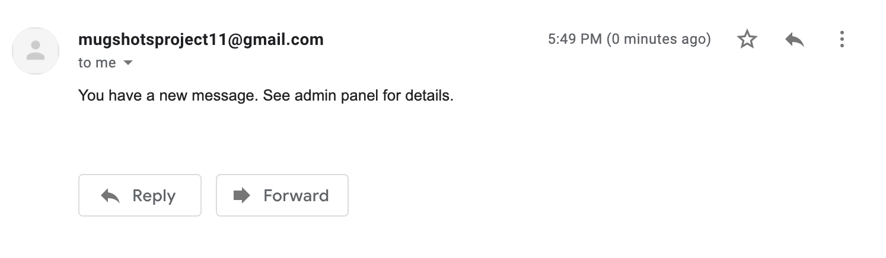
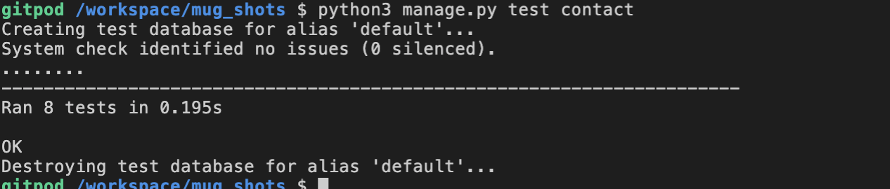
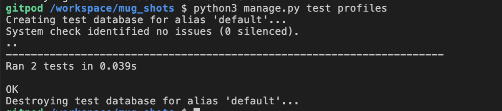
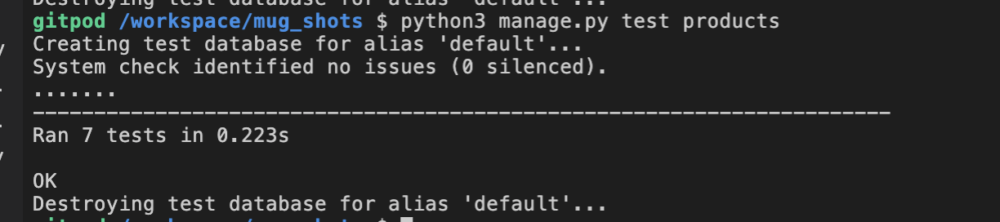

## Testing 

1. [Testing User Stories](#Testing)
    - [Shopper](#Shopper)
    - [Site User](#Site)
    - [Customer](#Customer)
    - [Store Owner](#Store)
2. [Manual Testing](#Manual)
3. [Automated Testing](#Automated)
4. [Bugs Found and Fixed](#Bugs)

### Testing User Stories

All user stories have been verified and have passed their tests.

##### Shopper:

> 1 : As a shopper, I want to be able to view a list of products, so that I can choose one to purchase                                                        

The first of the shopper user stories highlights the importance of viewing all products in one area. This is achieved in the products/shop page where the user can view a list of all the products currently in the database.

> 2 : As a shopper, I want to be able to view product details, so that I can identify price, description, and image                                        

To go along with the minimalist theme for the site, it was decided to have the additional details of the product on a separate page from the one where the user can view all products together. Once a user clicks on the image or button
on one of the cards on the products page, the user will be taken to a specific page where they can view all details of the product and add a nummber of that item to their cart.

> 3 : As a shopper, I want to be able to view the cart at anytime, so that I can manage my purchase                                                         

This is accomplished by being able to click the cart in the navbar, located at the top of the screen. The sticky class was applied to the navbar so as to have this feature available at all times for the user. If the user has items in their
cart, they will also be able to view a grand total on the navbar.

> 4 : As a shopper, I want to be able to adjust the quantity of items in my cart or completely remove them, so that I can manage my purchase                                                         

In the cart page, if the shopper has items in their cart, they will be able to view a table of the contents in the cart. In this table, they will be able to adjust the quantity of the item or remove it completely by clicking the respective button
or changing the quantity to zero.

##### Site User:

> 5 : As a site user, I want to be able to register for an account, so that I can have a personal account to view my profile                                    

When the user clicks on the "My Account" button in the navbar, they will be able to view a dropdown with the options to register or login to the website.
Using Allauth authentication system and custom styling, the user is able to register, get an email confirmation, and then sign in to their account. 

> 6 : As a site user, I want to be able to login and logout, so that I can easily access my personal information                                         

After registering for an account and verifing their email, the user will be able to login via the login page. If the form is valid when submitted, the user will be logged in.
When the user is done browsing and would like to sign out, they can once again navigate to the navbar, click the "My Account" button, and select "Logout".

> 7 : As a site user, I want to be able to recover my password , so that I can recover access to my account                                                  

On the login page, the user has the option to recover their password by clicking the button "Forgot password". This will prompt the user to enter their email
and a link helping them to reset their password will arrive. A future feature to add to the site is to add a "Reset password" function to the profile page to allow the user
to reset their password when already logged in.

> 8 : As a site user, I want to be able to receive an email conformation, so that I can verify my registration was successful                                         

After filling out the registration form, the user will be sent an email with a link to confirm their email. Opening this link will prompt the user to click to comfirm 
that this is their account. Once the email is confirmed, the user can sign in.

> 9 : As a site user, I want to be able to have a personalized user profile, so that I can view my personal information such as payment information and order history 

Once authenticated, the user can view their profile by going to the same "My Account" button in the navbar and selecting "My Profile". Here they will view a greeting to their name and/or username,
a form to save their prefered shipping information, and a table that contains their order history (if applicable). 

> 10 : As a site user, I want to be able to contact the store owner with any questions

If the user clicks on the "Contact" button in the navbar, they will be taken to a contact page where the user is able to fill out a form that will be sent to the store owner. If the user is logged in and their name
and email are saved to their profile, these fields will automatically be populated. The user is also able to view the address and map of the physical stoe by means of Google maps.

##### Customer:

> 11 : As a customer, I want to be able to leave a review, so that I can leave my testimonial and support this small business                          

If the user clicks on the "Gallery" button in the navbar, they will be taken to a page to view photos of other people's orders as well as cards that contain reviews.
Any visitor to the site, logged in or not, is able to view these reviews. Users who are logged in have the ability to add a review by the review form located just below the review cards.
If the form is valid when submitted, the user's review will appear next to the other reviews.

> 12 : As a customer, I want to be able to edit my review, so that I can edit my previously created review with new details                            

If the user is logged in and has previously created a review, they will be able to see two buttons on their review card to either edit or delete their review. Clicking the edit review will take the user
to a new page where they can edit their review. If the form is valid when submitting, their review will update and they will be taken back to the gallery page. Previously I had designed this function to be in a modal, however due to many errors, it was decided upon to move this form to its own page (More details in the bugs section).
Clicking on the delete button on the review card will bring up a modal asking the user if they are sure they want to delete the review. Clicking confirm will carry out the action of deleting and the review will be removed from the database.

> 13 : As a customer, I want to be able to sort the list of products, so that I can view the available products by the size I prefer                              

If the user clicks on the "Shop" button in the navbar to visit the page with all products, they will be able to see a group of buttons where they can select the category they would like to browse. To the right of this group of buttons, 
there is also a dropdown that gives the user the ability to sort by price (most expensive - least expensive  or vise versa) or by mug size.

> 14 : As a customer, I want to be able to search for a product by name or description, so that I can quickly find the product I am interested in                                   

In the footer located at the bottom of all pages, the user can see a search bar. Entering any word or short phrase in the search bar, then clickung the button beside it will allow the user to search all products in the database. Results will come up if there is a match in the name or description. 
If no results or the user does not submit a valid search, an error message will show, inviting the user to try again.

> 15 : As a customer, I want to be able to view items in my bag to be purchased, so that I can identify the products and total cost before I purchase                        

Navigating to the cart, either from the navbar or in the toast message after adding an item to the cart, will allow the user to view a table of all items in their cart. A subtotal is calculated
at the right of the table (product price * quantity). A grand total is located at the bottom.
Once clicking the checkout button at the bottom of the page, the user will also be able to view a preview of the items they will purchase.

> 16 : As a customer, I want to be able to adjust the quantity or remove items in my bag, so that I can easily make changes before checkout                                           

When the user is on the cart page, they will see a table of all the products currently in the cart. There is a quantity selector to allow the user to change the quantity of the product in their cart. Clicking "update" 
will save the changes. Clicking the delete button or setting the quantity to zero will remove the item from the cart.

> 17 : As a customer, I want to be able to enter my payment information, so that I can check out easily with no problems                                             

From the cart page, there is a button at the bottom of the page inviting the user to "checkout". This will bring them to the secure checkout page where they can enter their shipping information and payment information.
If the user is logged in and has their shipping information saved in their profile, these fields will already be populated.

> 18 : As a customer, I want to be able to view an order confirmation after checkout, so that I can verify there are no mistakes with my address, order, or payment information   

If the checkout form on the checkout page is valid when submitted, an overlay with a spinning arrow will appear letting the user know their order is being processed. Once the payment process has completed, the user will 
see a success message, their previously entered shipping details, as well as a summary of what they ordered. If the user is logged in, they can once again view this page from the "My account/"My Profile" page.

##### Store Owner:

> 19 : As a store owner, I want to be able to add a product, so that I can add a new item to my store                                                    

If the user is a superuser and is logged in, they will be able to view an additional page in the "My Account" dropdown on the navbar called "Management". Clicking on this page will bring up a form to allow the superuser
to add a new product to the store. When the form is valid on submit, the new product will be added to the shop page and the superuser will be directed there. If the user is not a validated superuser, they will not be able to access this page.

> 20 : As a store owner, I want to be able to edit a Product, so that I can change any details in the price or description                                

Navigating to a single product's page from the shop page will allow the user to view two additional buttons that other users will not be able to see, "edit" and "delete". Clicking on the "Edit" button will allow the superuser to access an editing form
for the product they are currently looking at. If the form is valid on submit, the product will be updated, and the user will be taken back to the shop page.

> 21 : As a store owner, I want to be able to delete a Product, so that I can remove items that are no longer available                                     

Navigating to a single product's page from the shop page will allow the user to view two additional buttons that other users will not be able to see, "edit" and "delete".  Clicking on the delete button will remove the product from the store.

> 22 : As a store owner, I want to be able to edit and delete reviews, so that I can manage customer reviews                                        

If the superuser clicks on the "Gallery" button in the navbar and navigates to the reviews, they will be able to see two additional buttons on every review, "edit" and "delete". The superuser has the ability to edit or delete any review. Clicking the edit review will take the user
to a new page where they can edit their review. If the form is valid when submitting, their review will update and they will be taken back to the gallery page. Previously I had designed this function to be in a modal, however due to many errors, it was decided upon to move this form to its own page (More details in the bugs section).
Clicking on the delete button on the review card will bring up a modal asking the user if they are sure they want to delete the review. Clicking confirm will carry out the action of deleting and the review will be removed from the database.

> 23 : As a store owner, I want to know if a contact form has been submitted, so I can write a reply to my customer

If a customer has submitted a contact form, the superuser email that is set up with the account will recieve a message (see the picture below). A future feature that I would like to add to the site is for the user to be able to view the contents of the message in a page on their profile and be able to respond directly from this website.

#### Browser testing
This website was tested on multiple devices with varying screen sizes and in multiple browsers. All devices and web browsers passed testing.

Web Browsers:
* Google Chrome
* Safari
* Firefox

Devices:
* Macbook Pro
* iPad Pro
* iPad Air
* iPhone x
* iPhone 11
* Samsung Galaxy S20 Ultra 

The primary method of testing the browsers was to ask several users to visit the website using these different devices and web browsers. Each user was asked to complete a test purchase, register and login to a new account, and create, edit, and delete their reviews.

### Manual Testing

Manual testing was performed on all of the previously mentioned browsers and devices. All tests have been either sucessful or fixed at the time of submission. Additional information is included in the "Bugs" section of this document. Details are as follows:

##### Navigation Bar
Since the footer is visible on all pages, it was tested many times to ensure it worked across the site. 

On medium and large screens:
* Clicking on the logo on the left side of the page will redirect the user to the home page.
* Clicking on the "Home" button in the navbar will redirect the user to the home page.
* Clicking on the "Shop" button in the navbar will redirect the user to the shop page.
* Clicking on the "Gallery" button in the navbar will redirect the user to the gallery page.
* Clicking on the "Contact" button in the navbar will redirect the user to the home page.
* Clicking on the "My Account" button in the navbar will show a dropdown menu. If the user is not logged in,
they will see the links "Register" or "Login". If the user is authenticated, the will see the links "My profile" and "Logout" instead.
Additionally, if the user is a superuser, they will see a link "Management". Clicking on any of these links in the dropdown will bring the user
to the proper page.
* Clicking on the cart icon will bring the user to the current shopping cart page.
* If the user is actively on the home, shop, gallery, or contact page, the coffee cup icon will show a border shaddow in white.

Small screens:
* The navbar will automatically be collapsed. To show the contents of the navbar, the icon with three dots must be clicked to reveal or hide the navbar content.
* Clicking on the logo on the top of the page will redirect the user to the home page.
* Clicking on the "Home" button in the navbar will redirect the user to the home page.
* Clicking on the "Shop" button in the navbar will redirect the user to the shop page.
* Clicking on the "Gallery" button in the navbar will redirect the user to the gallery page.
* Clicking on the "Contact" button in the navbar will redirect the user to the home page.
* Clicking on the "My Account" button in the navbar will show a dropdown menu. If the user is not logged in,
they will see the links "Register" or "Login". If the user is authenticated, the will see the links "My profile" and "Logout" instead.
Additionally, if the user is a superuser, they will see a link "Management". Clicking on any of these links in the dropdown will bring the user
to the proper page.
* Clicking on the cart icon will bring the user to the current shopping cart page.

On all screens, when the user scrolls down, the background of the navbar turns white.

##### Footer
Since the footer is visible on all pages, it was tested many times to ensure it worked across the site. 
* The Contact us text renders as expected
* Hovering over the social links swaps the color/background color
* Clicking on any of the three social links will open that respective link in a new page (Facebook, Twitter, Instagram).
* Clicking the search button without entering any search query will send a toast with an error message inviting the user to try again.
* Entering a valid search entry will bring the user to the shop page and will show any products that match the name/description of the search.
* If the user were to enter a search querry where no products match, they will see a message which says "No results found" and a button that says "Shop Now".
* Hovering over the "Shop Now" button will change the background color to yellow.
* Clicking on the "Shop Now" button will redirect the user to the shop page to view all produucts. 

##### Home
* All Images render as expected.
* Hovering over the "Shop Now" button will swap the color and background color.
* Clicking the "Shop Now" button in the main jumbotron will take the user to the shop page.
* Hovering over the "Comission a Piece" button will swap the color and background color.
* Clicking on the "Comission a Piece" button near the bottom of the page will take the user to the shop page.

##### Shop
* Hovering over the category buttons will change the color of the text from black to white.
* Clicking on any of the category buttons will show only the product results for that category.
* If no results in a category, there will be a message which says "No results found" and a button that says "Shop Now".
* Hovering over the "Shop Now" button will change the background color to yellow.
* Clicking on the "Shop Now" button will redirect the user to the shop page to view all products. 
* Hovering over the "Sort" button will change the color of the text from black to white.
* Clicking the button to "sort" will open a small dropdown menu. Hovering over any of the four links will swap the color and background color
* Clicking on one of the links in the "Sort dropdown" will correctly sort the items by price (most expensive to least expensive or least expensive to most expensive) 
or by category size (small to large or large to small)
* All products in the database will be viewed in cards, organized by the grid system 
* The correct photo, name, price, and category appear on each product card.
* Hovering over the image of the product will lighten the opacity of the image and show the name of the product
* Clicking on the picture of the product will bring the user to the correct "One Product" page.
* Hovering over the "View more info" button will change the background color from green to yellow.
* Clicking on the "View more info" button will bring the user to the correct "One Product" page.
* As the user scrolls down the page, the "To top" button with an upwards arrow will appear at the bottom right of the screen. Clicking this button will bring the user back to the top of the page.

##### One Product
* Viewing the "One Product" page will show all of the correct information for the selected product
* The image for the product renders correctly.
* To select the quantity of a product, the user can click the plus or minus buttons to change the number, use the up/down buttons on their keyboard, or click in the select itself. Taking any of these actions will
adjust the number
* Hovering over the "Keep Shopping" button will change the background color from green to yellow.
* Clicking on the "Keep Shopping" button will redirect the user to the shop page 
* Hovering over the "Add to Cart" button will change the background color from green to yellow.
* Clicking on the add to cart button will post the form and add the selected quantity of this item to the cart.
* A toast will appear with a success message and a brief preview of what is in their cart.
* In the toast, a message will alert the user to how much more they would need to spend to take advantage of the free shipping
* Clicking on the Checkout button in the toast will bring the user to the cart page.
* When an item is added to the cart, the grand total (on medium and large screens) in the navbar will update to reflect this change.
* If the user is a super user, they will see two additional buttons- Edit and delete.
* Clicking on the edit button will give the user the functionality to edit the product they are currently on.
* If the form is valid on submit, the product will update to the database and they will be taken back to the previous page.
* If the user clicks on the delete button, the product will be deleted and a success toast will show, alerting the superuser they deleted a product.

##### Gallery
* All images render and are responsive in the grid. 
* Hovering over an image will darken the image, show the name of the product, and the number of hearts.
* Clicking on any of the grid images will open a new page with the store's instagram
* Clicking on the @mugshots_mugs link will open a new page with the store's instagram
* Review cards are shown for each review in the database. The title, product, description, image, and name of user who wrote the review show as expected.
* If the user who wrote the review is logged in and viewing this page, they will see buttons to "edit" or "delete" their review. They only view these buttons on their review.
* Clicking on the "edit" button will bring the user to a new page where they can edit the form for their review.
* If the form is Valid on sumbit, the user's review will be updated in the database and will be brought back to the gallery page.
* Clicking on the "delete" button will open a modal, asking the user if they are sure they want to delete the review.
* If the user is a superuser, they can edit or delete ANY review following the steps above.
* Gallery carousel shows five pictures and can be navigated by clicking the arrow buttons.

##### Contact
* The map with the location of the physical store renders as expected. (This store/address is fictional, so the city of San Fransisco, CA was selected for development).
* The user can fill out the form to contact the store owner. If the form is valid on submit, the form will be sent to the superuser's email and a success toast will appear.
* Hovering over the "Submit" button will change the background color from green to yellow.
* If the user is already logged in and has their credentials saved to their profile, these fields will automatically be populated for the user.
* When a user submits a contact form to the store owner by clicking the "Submit" button, the store owner recieves an email. 

##### Profile
* The user must be logged in to view this page. 
* The user is greeted with a personalized message. 
* The user can fill out the form to save their default shipping information. If they make a purchase, the shipping information will be filled out for them.
* Hovering over the "Update Information" button will change the background color from green to yellow.
* If the form is valid when clicking the "Update Information" button, the details will be saved in the form and in the database.
* The user can view all past orders in a table if there are past orders.
* If there are past orders, clicking on the order number will take the user to the checkout-success page they viewed when they checked out to see the contents of their purchase.

##### Management
* This page is only viewable by the superuser.
* The superuser can fill out the form to add a product to the database.
* Hovering over the "Add Product" button will change the background color from green to yellow.
* Hovering over the "Cancel" button will change the background color from green to yellow.
* If the form is valid when clicking the "Add Product" button, the new product will be submitted to the database and the user will be redirected to the products page.
* Clicking the "Cancel" button will redirect the user to the shop page to view all products.

##### Cart
If the user has not added anything to their cart:
* If the user has not added any items to the cart, a message shows stating "Your Cart is empty".
* If the user has not added any items to the cart, a "Keep Shopping" button shows.
* Hovering over the "Keep shopping" button will change the background color from green to yellow.
* Clicking the "Keep Shopping button will take the user back to the shop page.

If the user has added items to their cart:
* If the user has added items to the cart, they will be able to see the product picture, name, sku, price, a quantity selector, and a subtotal in a table for each of the items added to the cart.
* If the user has added items to the cart, to adjust the quantity of a product, the user can click the plus or minus buttons to change the number, use the up/down buttons on their keyboard, or click in the select itself. Taking any of these actions will
adjust the number. 
* Clicking "Update" will save the users preferences and refresh the page. A toast will also appear notifying the user of a change.
* Changing the quantity to 0, then clicking update will remove the item from the cart. A toast will notify the user that an item has been deleted from the cart.
* Clicking the "delete" button will remove the item from the cart and refresh the page. A toast will notify the user that an item has been deleted from the cart.
* The user will be able to view a grand total of all products at the bottom of the table.
* If the total cost of the user's order is under the free delivery threshold, a message will appear alerting the user to how much they should spend to get free shipping.
* At the bottom of the page, hovering over the "Keep shopping" button will change the background color from green to yellow.
* Clicking the "Keep Shopping button will take the user back to the shop page.
* At the bottom of the page, hovering over the "Checkout" button will change the background color from green to yellow.
* Clicking on the checkout button will take the user to a secure checkout page.

##### Checkout
* The user can view a preview of what they will purchase in a table. The table includes a product name, image, quantity, subtotal for each item. At the bottom of the table, the user can see the grand total and shipping cost.
* The user is able to fill out the checkout form.
* The user can check or uncheck the box near the bottom to "Save my information" to save their information to their profile for future purchases.
* If the user is logged in and has previously saved their shipping information to their profile, the affected fields will already be populated.
* The user must fill in a valid credit card to be able to submit the form
> Note: Due to Stripe's testing features, If you would like to test the payment functionality of this project, please use the following payment details:
        - Card number: 4242 4242 4242 4242 
        - CVC: any 3 digit number
        - Exparation Date: any future date
* Hovering over the "Edit Cart" button will change the background color from green to yellow.
* Clicking the "Edit Cart" button will take the user back to their cart (the previous page).
* Hovering over the "Complete order" button will change the background color from green to yellow.
* If the form is valid when clicking the "Complete Order" button, it will take the user to a checkout-success page.
* While the page is loading, an overlay with a spinning arrow appears to let the user know their order is being processed.
* Once the order has been processed sucessfully, a checkout success page is rendered with a table showing the details of their order and shipping information.
* An email will be sent to the management and the user.

##### Login/register
* If the user has not created an account, they must register first. If the user does not exist and tries to login, they will see a message "The e-mail address and/or password you specified are not correct." and be invited to try again.
* To register, if the form is valid when clicking the "sign up" button, they will be taken to a page that asks them to confirm their email before they continue.
* After visiting the link provided in the email, the user will be asked to click to confirm this email address. 
* After clicking the "confirm" button, the user will be able to sign in.
* If the user has an account, they can fill out the signin form and sucessfully sign in. 
* After signin in, a success toast will appear notifying the user and they will be redirected to the home page.
* If the user would like to logout, they can click the logout button in the navbar under the "My account" dropdown. They can then click the "logout" button to successfully logout.
* Once they have logged out, a success toast will appear notifying the user and they will be redirected to the home page.
* If the user would like to sign in, but has forgotten their password, they can click the "forgot password" button on the sign in page to reset their password via email.
* After visiting the link provided in the email, the user will be asked to write a new password and click submit. 
* After clicking submit, the user will be redirected to the sign in page and can login as normal.
* Hovering over any of the submit buttons on these forms will change the background color from green to yellow.

### Automated Testing

Additional automated testing was added to test the functionality of the python files required for the website.
Due to time contstraints, the python code is not 100% covered by these automated tests. In the future, I plan to add more testing so that all of the apps will be covered.

Testing was carried out by means of a tests.py file. Test cases were created for the Contact app, the Profiles app, and the Products app.

##### Contact app

Tests in the contact app were created to test the view, that the contact page renders with the correct template, and the contact form.
The test cases for the contact form were written to check that validation works when a user doesn't fill in at least one field. In the contact form, all fields are required.

Test Results: Pass

##### Profiles app

A test in the profiles app was created to test that the redirect is working properly. Since a user must be logged in to view a profile, a user who tries to access this page and is not logged 
in will be redirected.

The second test case checks that the form located in the user profile is valid. This form allows the user to save their default shipping information for a later use. 

Test Results: Pass

##### Products app

Several tests were created for the products app including testing for the views, the models, and the form to add a new product.
First, the views that show 1) all products on the shop page and 2) just one specific product from the database were tested to make sure the pages render correctly.

Next, the products model was tested to check that the product fields equal the saved products values.

The final test in this category was on the product form. The product form requires all fields to be valid before being able to submit. Since adding and editing a product is something only a superuser is able to do, this form just checks that an average user
cannot make any changes to products. This case is expected to be false, instead of true.

Test Results: Pass

### Validation

Validator websites were used to test the following:

HTML - W3C Html Checker:
Doing so brought up a few errors throughout the project related to using Django templates. These included an issue in using '{}' brackets as part of the source for <a> elements and  elements. However, this syntax is necessary to access static files and urls and was therefore ignored.
All html templates led to errors that the doctype and language were not declared. As the templates were based on the base.html template where these were addressed, this issue was also ignored.
Some Bootstrap Modals on the site returned errors with their 'aria-labelledby' attribute. This error was related to using templating language to specify the item the modal was related to, so this error was also ultimately ignored.

CSS - W3C CSS Checker - No errors found

JavaScript - JSHint - No errors found

Python - PEP8 Online Check - a number of whitespace and lines too long warnings.

### Bugs Found and Fixed
During development and ongoing testing of the website both local and deployed links were found to have several bugs that proved to be a little more than a quick fix. 

1. As mentioned earlier in the gallery section, if the user is logged in and has previously created a review, they will be able to see two buttons on their review card to either edit or delete their review. Clicking the edit review will take the user
to a new page where they can edit their review. Previously I had designed this edit function to be in a modal just as the delete function, however due to many errors trying to populate the edit form, it was decided upon to move this form to its own page.
Because the function for editing the form wasn't properly called when the button to open the modal was clicked, the edit form was not being populated with data from the review and instead was a blank form. Due to the complexity of changing this function to retrieve the data from 
the database when the modal was opened this was simplified. Now when the user clickes on the edit button on the review, they will be taken to a new page to edit their form. 

2. When the user is logged in, has their personal data saved, and is on the contact page, the contact form will automatically render their first and last name as well as the email. However, I got mixed up with my field names in the forms and models for that app causing these fields not to 
populate. Overall it was an easy fix. I was originally trying to call a username and a full name, when my form required a first name and last name. These issues were resolved and now work as expected.

3. There was a bug occuring in the add to cart function. When a user tried to add an item to the cart, nothing happened and a POST 302 error occured. Testing this function with a print statement confirmed that the function was working and retrieved the correct data. It was found that
a small line of code in the context processors section of the settings file was missing. This was added in and tested again. After testing this time, the function worked as expected.

4. Many of the errors and bugs found during this project were due to syntax errors, proper punctuation or capitalization. Once fixed, the code began to run as expected.

[Return to main README](#README.md)